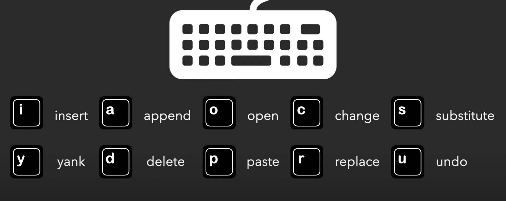

# Vim 学习

参考视频地址
https://www.youtube.com/watch?v=Yk4s-WLjxug&t=189s

vim 是一种编辑方式、优点在于：

- 速度快 - 开发速度快
    - 开启档案快
    - 编辑速度快
- 精准定位
- 酷

## 输入快

所有命令都可以随意组合使用

- 3dd 就是 删除 3 行文字
- vim . 查看当前的档案目录

## 模式切换

### vim 暂存到后台。从 bash 中操作完成再回到 vim 前端

- Ctrl + z  【vim 进入后台】
- fg    【vim 进入后台】

### 移动游标 左 H 下 J 上 K 右 l

- `w/W` 向后跳一个字， w 会被标点符号挡住，W不会
- `b/B` 向前回退一个字，
- `Ctrl + {` 上移动一个段落. `{{` 上到文件头
- `Ctrl + }` 下移一个段落。`}}` 下到文件尾
- `gg` 移到文件第一行
- `G` 移到文件最后一行
- `0` 移到行首、`$`移到行尾
- `gj` 往下移动一行
- `gk` 往上移动一行

### 搜索关键字

- `/` 进入search，后面直接输入要search的文本
- `:set hlsearch` 设置搜索结果高亮 `hl 即 high light`
- `n/N` 直接跳到上一个/下一个搜索结果。 `n 即 next`

- `?` 同上搜索关键字，只是 `n/N` 查询顺序相反
- `*` 搜寻当前游标所在字的这个单词。(汉字同样适用、以前后空格作为此组分隔)

- `fx` 找到当前行后面最近的一个 x。 `f 即 find` 
- `Fx` 找到当前行前面最近一个 x

- `zt` 将当前行排版到 top顶部
- `zz` 将当前行排版到中间
- `zb` 将当前行排版到 bottom 底部

### 选取、复制、粘贴

- `v` 进入 visual 模式
- `V` 进入 visual 模式，并直接选中一行。之后的移动也是按行选中
- `y` 需要先选中，复制选中的字符 `y=yank=复制`
- `yy` 无需复制，直接选中一整行
- `p` 粘贴复制的内容 `p=paste`

---- 高级 ----

- `3yy` 复制游标所在行以下的 3 行
- `yG` 复制到行尾
- `p/P` p在游标处粘贴文字。P在游标前粘贴文字。如果复制一整行，则是在游标的上一行、下一行粘贴
- `u` 回到上一步，undo
- `Ctrl + r` 重新再做一次， redo

被复制的内容，复制到了 vim 内部的暂存器(Register)中。我们可以指定某次复制的内容到指定的暂存器。
vim 共有 48 个暂存器，我们可以设置暂存器和系统粘贴板共通。

- `"ay` 把内容存到 a 暂存器, `"ap` 把 a 暂存器的东西粘贴出来
- `"by` 把内容存到 b 暂存器, `"bp` 把 b 暂存器的东西粘贴出来
- `:reg` 查看目前所有暂存器的内容
- `:set clipboard=unnamed` 设置系统粘贴板和vim 暂存器共通

### 编辑文字

- `I` 直接进入编辑模式，并将光标放置到行首
- `A` 直接进入编辑模式，并将光标放置到行尾
- `O` 直接进入编辑模式，并在光标上一行开启新一行
- `x` 删除光标当前所在文字，并将删除的内容放到暂存器
- `d` 删除当前所选中文字，并将删除的内容放到暂存器
- `D` 删除当前光标之后的内容，并将删除的内容放到暂存器
- `dd` 删除当前整行内容，并将删除的内容放到暂存器
- `dG` 删除光标之后所有内容，并将删除的内容放到暂存器
- `dgg` 删除光标之前所有内容，并将删除的内容放到暂存器
- `c` 删除选取的内容，并进入 inset mode，并将删除的内容放到暂存器
- `C` 删除光标之后的内容，并进入 inset mode，并将删除的内容放到暂存器
- `r` replace 当前光标所在内容
- `>> or <<` 增加或者减少当前行的缩进，支持设置数字，直接执行多少次
- `=` 对选取的内容进行缩进排版。会自动根据当前语言上下文进行缩进排版

### 编辑多个档案 01

https://www.youtube.com/watch?v=pi4JzuzcP6Q&list=PLBd8JGCAcUAH56L2CYF7SmWJYKwHQYUDI&index=10

https://www.youtube.com/watch?v=5_bQ4BfiN1A

