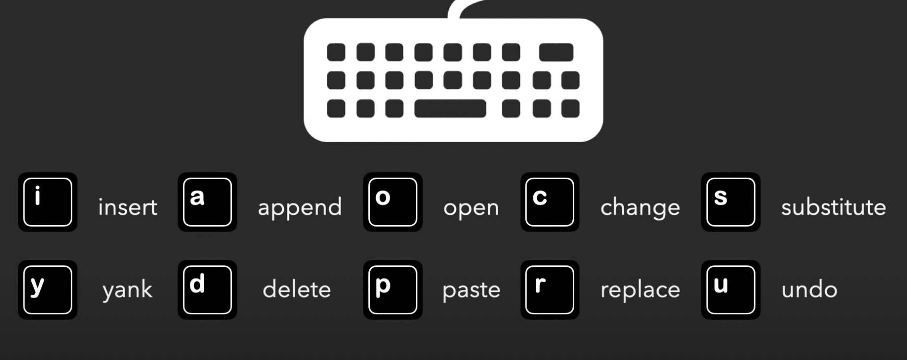
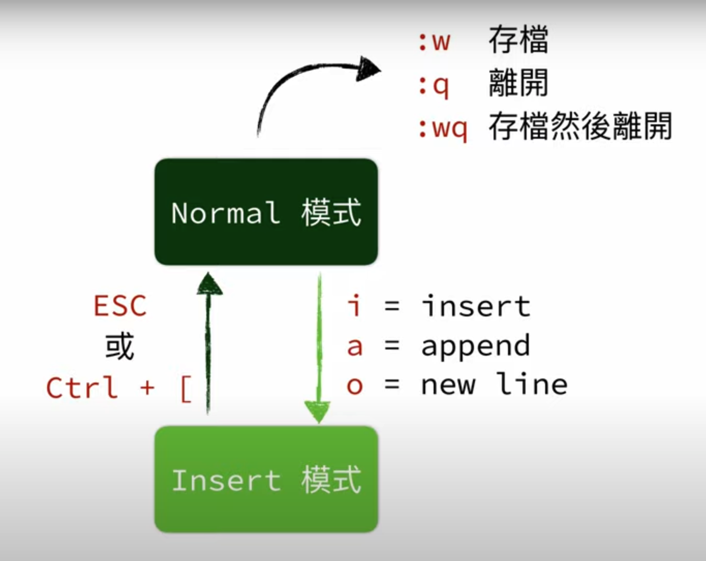
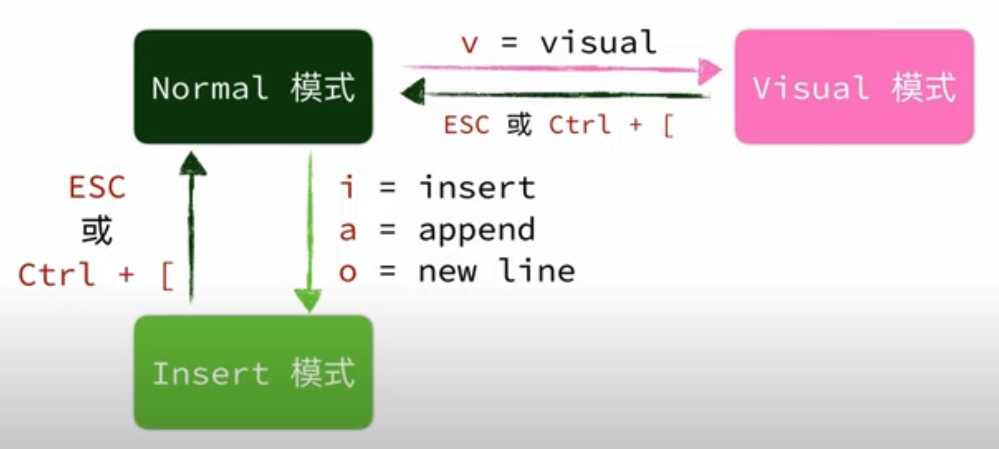

# Vim 学习

本文记录一些我在学习 vim 编辑器过程中的一些记录。

vim 是一种编辑方式、优点在于：

- 速度快 - 开发速度快
    - 开启档案快
    - 编辑速度快
- 精准定位
- 酷

## 输入快




所有命令都可以随意组合使用

- 3dd 就是 删除 3 行文字
- vim . 查看当前的档案目录

## 一些示例

```
public class AppMain{
    public static void main(String[], args){
        String msg01, msg02, msg03;
        String apple01, apple02, apple03;
        System.out.println(""Hello World);
    }
}
```

选取指令组合
- 选取单字 `v w`
- 选取到 " `w t "` -- word to "
- 选取到 " `v f "` -- 找到 "

## 模式切换



### vim 暂存到后台。从 bash 中操作完成再回到 vim 前端

- Ctrl + z  【vim 进入后台】
- fg    【vim 进入后台】

### 移动游标 左 H 下 J 上 K 右 l

- `w/W` 向后跳一个字， w 会被标点符号挡住，W不会
- `b/B` 向前回退一个字，
- `Ctrl + {` 上移动一个段落. `{{` 上到文件头
- `Ctrl + }` 下移一个段落。`}}` 下到文件尾
- `gg` 移到文件第一行
- `G` 移到文件最后一行
- `0` 移到行首、`$`移到行尾
- `gj` 往下移动一行
- `gk` 往上移动一行

### 搜索关键字

- `/` 进入search，后面直接输入要search的文本
- `:set hlsearch` 设置搜索结果高亮 `hl 即 high light`
- `n/N` 直接跳到上一个/下一个搜索结果。 `n 即 next`

- `?` 同上搜索关键字，只是 `n/N` 查询顺序相反
- `*` 搜寻当前游标所在字的这个单词。(汉字同样适用、以前后空格作为此组分隔)

- `fx` 找到当前行后面最近的一个 x。 `f 即 find` 
- `Fx` 找到当前行前面最近一个 x

- `zt` 将当前行排版到 top顶部
- `zz` 将当前行排版到中间
- `zb` 将当前行排版到 bottom 底部


### 选取、复制、粘贴



- `v` 进入 visual 模式
- `V` 进入 visual 模式，并直接选中一行。之后的移动也是按行选中
- `y` 需要先选中，复制选中的字符 `y=yank=复制`
- `yy` 无需复制，直接选中一整行
- `p` 粘贴复制的内容 `p=paste`

---- 高级 ----

- `3yy` 复制游标所在行以下的 3 行
- `yG` 复制到行尾
- `p/P` p在游标处粘贴文字。P在游标前粘贴文字。如果复制一整行，则是在游标的上一行、下一行粘贴
- `u` 回到上一步，undo
- `Ctrl + r` 重新再做一次， redo

被复制的内容，复制到了 vim 内部的暂存器(Register)中。我们可以指定某次复制的内容到指定的暂存器。
vim 共有 48 个暂存器，我们可以设置暂存器和系统粘贴板共通。

- `"ay` 把内容存到 a 暂存器, `"ap` 把 a 暂存器的东西粘贴出来
- `"by` 把内容存到 b 暂存器, `"bp` 把 b 暂存器的东西粘贴出来
- `:reg` 查看目前所有暂存器的内容
- `:set clipboard=unnamed` 设置系统粘贴板和vim 暂存器共通

### 编辑文字

- `I` 直接进入编辑模式，并将光标放置到行首
- `A` 直接进入编辑模式，并将光标放置到行尾
- `O` 直接进入编辑模式，并在光标上一行开启新一行
- `x` 删除光标当前所在文字，并将删除的内容放到暂存器
- `d` 删除当前所选中文字，并将删除的内容放到暂存器
- `D` 删除当前光标之后的内容，并将删除的内容放到暂存器
- `dd` 删除当前整行内容，并将删除的内容放到暂存器
- `dG` 删除光标之后所有内容，并将删除的内容放到暂存器
- `dgg` 删除光标之前所有内容，并将删除的内容放到暂存器
- `c` 删除选取的内容，并进入 inset mode，并将删除的内容放到暂存器
- `C` 删除光标之后的内容，并进入 inset mode，并将删除的内容放到暂存器
- `r` replace 当前光标所在内容
- `>> or <<` 增加或者减少当前行的缩进，支持设置数字，直接执行多少次
- `=` 对选取的内容进行缩进排版。会自动根据当前语言上下文进行缩进排版

### 编辑多个档案 01

在命令行模式中

- `:e {FileName}` 开始档案
- `:tabe {档案名称}` 页签的方式开启指定档案
- `gt` 切换到下一个分页
- `gT` 切换到上一个分页
- `:new` 新建立一个分割视窗 `:vnew` 新建一个垂直分割视窗
- `Ctrl + w + hjkl` 切换到指定页签
- `Ctrl + w` 循环移动页签
- `vim -o *` 水平页签方式打开所有文档、 `vim -O *`垂直页签方式打开所有文档
- `vim -p *` 用页签的方式开启当前目录下的所有档案


## 进入插入模式的各种方法


| 按键 | 含义  |
| --- | --- |
| i | 光标前进入插入模式 |
| I | 在光标所在行首进入插入模式 |
| a | 在光标的后边进入插入模式 append |
| A | 在光标所在行尾进入插入模式 |
| o | 在光标所在行下方插入空行并进入插入模式 |
| O | 在光标所在行的上方插入空行并进入插入模式 |
| s | 删除光标指定的字符，并进入插入模式 |
| S | 删除光标所在行并进入插入模式 |


## Motion -- 表示操作范围的指令

| 按键 | 含义  |
| --- | --- |
| 0 | 将光标定位到行首的位置 |
| ^ | 同上 |
| $ | 将光标定位到行尾的位置 |
| b | 将光标定位到当前单词的首字母、将光标迁移到上一个单次首部 |
| e | 将光标定位到所在单词结尾字母、将光标移动到下一个单词结尾 |
| w | 将光标定位到下一个单词的结尾处 |
| gg | 光标定位到文件的开头 |
| G | 将光标定位到文件的结尾 |


## DELETE -- 删除命令

删除命令 d , 可以结合 数字 Motion 共同使用

| 按键 | 含义  |
| --- | --- |
| d0 | 删除光标当前位置(不包含)到行首 |
| d^ | 同上 |
| d$ | 删除光标当前位置(包含)到行尾 |
| db | 删除从光标当前位置到是字母的所有字符 |
| de | 删除从光标当前位置带单词结尾的所有字符 |
| dw | 删除从光标当前位置到下个单词起始处的所有字符 |
| dh | 删除光标前面的一个字符 |
| dl | 删除光标指定字符 |
| dj | 删除光标所在行以及下一行的所有字符 |
| dk | 删除光标所在行以及上一行的所有字符 |
| dd | 删除当前光标所在行的字符 |
| dgg | 删除光标所在行到文件的开头的所有字符 |
| dG | 删除光标所在行到文件的结尾的所有字符 |


## 数字的奥义

- 数字 +  motion = 多个重复的 motion
- d + 数字 + motion = 删除多个 motion 范围

## 后悔药 - u

- u 表示撤销最后一个修改
- U 表示撤销对整行的修改
- Ctrl + r 快捷键可以恢复撤销的内容

## 粘贴命令 - p

- 在 Vim 中使用功能删除命令，并不会直接将的东西直接删除，而是放在 vim 的寄存器中
- 使用 p 命令可以将最后一次删除的内容粘贴到光标之后(P 则是粘贴到光标之前)

如果需要粘贴的是整行为单位，在 p 命令将在光标的下一行开始粘贴
如果拷贝的是非整行的局部字符串，那么命令 p 将在光标之后粘贴

## 拷贝命令 - y

Vim 用 y 命令实现拷贝: y [数字] motion

## 替换命令 - r

- r 命令用于替换光标所在的字符，做法是先将光标移动到需要替换的字符处，按一下 r 键，然后输入新的字符
- 在键入 r 命令之前输入数字，表示从光标处开始，将多个字符统一替换为新字符

## 修改命令 - c

vim 用 c 命令实现修改: c [数字] motion

| 按键 | 含义  |
| --- | --- |
| c0 | 删除光标从当前位置(不包含)到该行行首的所有字符，并进入插入模式 |
| c^ | 同上 |
| c$ | 删除从光标当前位置(包含)到该行行尾的所有字符，并进入插入模式 |
| cb | 删除从光标当前位置(不包含)到单词的首字母，并进入插入模式 |
| ce | 删除从光标当前位置(包含)到单词的首结尾处，并进入插入模式 |
| cw | 删除从光标当前位置(不包含)到下个单词的起始处，并进入插入模式 |
| ch | 删除光标前面的一个字符，并进入插入模式 |
| cl | 删除光标指定字符，并进入插入模式 |
| cj | 删除光标所在行以及下一行的所有字符，并在光标下一行进入插入模式 |
| ck | 删除光标所在行以及上一行的所有字符，并在光标上一行进入插入模式 |
| cc | 删除光标所在行的所有字符，并进入插入模式 |


**修改 == 删除 + 进入插入模式**

## 跳转到指定行

- 行号 + G
- : 行号

## 定位括号

按下 % 键位，快速帮你定位另一半括号

## 缩进

`>>` 往右缩进
`<<` 反向缩进

## 搜索命令

- /目标
- ?目标

|  | /目标 | ?目标 |
| --- | --- | --- |
| 搜索方向 | 从光标开始向后 | 从光标开始向前 |
| n  | 向后搜索下一个 | 向前搜索下一个 |
| N | 向前搜索下一个 | 向后搜索下一个 |


## 十个特殊字符

特殊字符即系统保留字，本身作为功能命令，使用需要转义

```
. * [] ^ % / ? ~ $
```

## 替换命令

- `:s/old/new` 表示将光标所在行的第一个 old 替换为 new
- `:s/old/new/g` 表示将光标所在行的所有 old 替换为 new
- `:%s/old/new/g` 表示替换整个文件中所有的 old 为 new
- `:%s/old/new/gc` 同上，但是会在每次只替换之前先指示，可根据指示做操作
- `:5,13s/old/new/g` 表示替换第 5 行到 13 行中所有的 old 为 new

## 在 vim 中执行 shell 命令

:! + shell 命令

## 文件另存为

:w 文件名

## 局部文件另存为

1. 进入可视模式
2. :w 文件名


